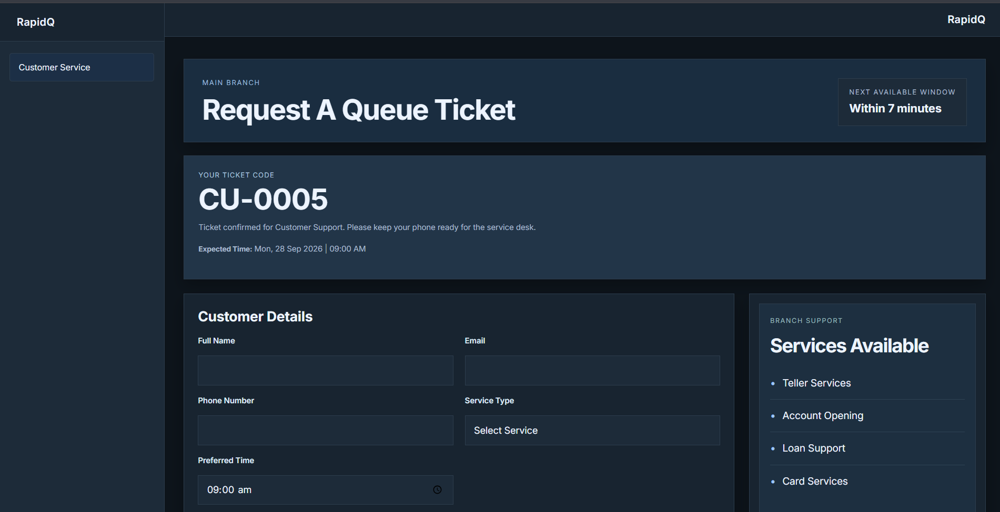
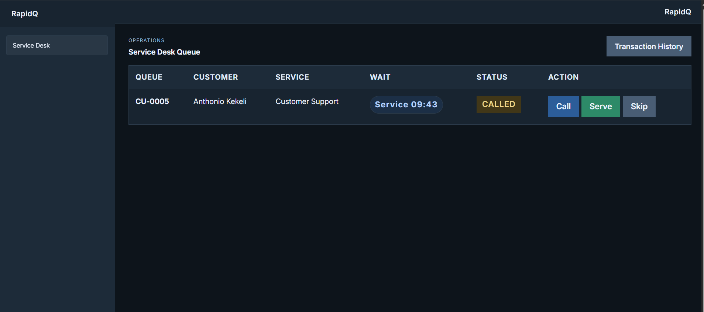

# RapidQ

RapidQ is a modern queue and appointment management experience designed for service-focused businesses, with a strong emphasis on banking and branch operations.

## Overview

RapidQ helps customers request service without confusion, while giving staff a clear view of who is waiting, who is being served, and what has already been completed. It creates a smoother front-desk experience for both visitors and service teams.

## What customers experience

- Easy ticket request from a clean customer-facing form
- Service selection based on the type of assistance needed
- Appointment date and preferred time selection
- Clear queue ticket confirmation with expected wait information
- A simple, professional experience that feels reliable and organised

## What staff experience

- A single dashboard for active queue management
- Clear visibility into customer details and service type
- Fast call and service actions for frontline staff
- Access to completed and missed appointments for follow-up
- A history view that supports better service tracking and reporting

## Why it matters

In a busy service environment, waiting time and communication matter. RapidQ reduces uncertainty for customers and gives staff the structure they need to work efficiently, fairly, and professionally.

## Purpose

RapidQ is built to support a modern service desk where customers feel informed, staff stay in control, and every appointment is managed with clarity from request to completion.

